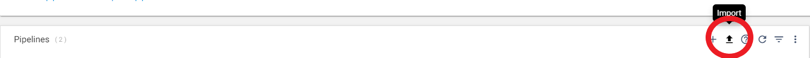

<h1>
AVRO to Parquet
</h1>

# AVRO to Parquet (Updated: 2022.08)

## Built with Data Collector v5.1.0 - please use engine v5+

## This process is documented [here](https://docs.streamsets.com/portal/platform-datacollector/latest/datacollector/UserGuide/Processors/WholeFileTransformer.html#concept_ch5_z3g_n2b) and contains more details of the process and settings

## PREREQUISITES

* Access to [StreamSets DataOps Platform](https://cloud.login.streamsets.com/) account
  * Setup [Environment](https://docs.streamsets.com/portal/#platform-controlhub/controlhub/UserGuide/Environments/Overview.html#concept_z4x_nw2_v4b)
  * Setup [Deployment](https://docs.streamsets.com/portal/#platform-controlhub/controlhub/UserGuide/Deployments/Overview.html#concept_srv_jgf_v4b) with engine type [Data Collector](https://docs.streamsets.com/portal/#datacollector/latest/help/datacollector/UserGuide/Getting_Started/GettingStarted_Title.html#concept_sjz_rmx_3q)
    * Once a deployment has been successfully activated, the Data Collector engine should be up
and running before you can create pipelines and run jobs.

## OVERVIEW

Let's say we have several thousand small objects (csv) in a file system such as Local File or Amazon S3. We want to convert the numerous small objects to large Parquet objects so we can more quickly analyze the data.

To do this, we set up two pipelines. The first pipeline reads the files and writes large Avro files to a local file system. This is the AVRO2Parquet_pt1 pipeline. The second Parquet Conversion pipeline reads the Avro files as whole files and transforms each file to a corresponding Parquet file, which is written back to a file system.

**Disclaimer:** *These pipelines are meant to serve as a template.  Some of the parameters, tables and fields may be different for your environment and may need additional customizations.  Please consult the StreamSets documentation (linked below) for full information on configuration of each stage used below.*

## PIPELINE #1 - AVRO2Parquet_pt1

## DOCUMENTATION

[Directory Origin](https://docs.streamsets.com/portal/platform-datacollector/latest/datacollector/UserGuide/Origins/Directory.html#concept_qcq_54n_jq)

[Schema Generator](https://docs.streamsets.com/portal/platform-datacollector/latest/datacollector/UserGuide/Processors/SchemaGenerator.html#concept_rfz_ks3_x1b)

[Local FS Destination](https://docs.streamsets.com/portal/platform-datacollector/latest/datacollector/UserGuide/Destinations/LocalFS.html#concept_zvc_bv5_1r)

## STEP-BY-STEP

### Step 1: Download the pipeline

[Click Here](./AVRO2Parquet_pt1.zip?raw=true) to download the pipeline and save it to your drive.

### Step 2: Import the pipeline

**For more information on Importing Pipelines, click [here](https://docs.streamsets.com/portal/platform-controlhub/controlhub/UserGuide/ExportImport/Importing.html#concept_gsm_tjx_bdb)**

Click the up arrow in the Pipelines list to start the import process.

Select 'Archive File', enter a Commit Message, then click "Browse File" and locate the pipeline file you just downloaded and select it. Click "Import"

### Step 3: Configure the parameters

Click on the pipeline you just imported to open it, click Edit and then click on the "Parameters" tab and fill in the appropriate information for your environment (Ensure the "Show Advanced Option" is turned on).

**Important:** *The pipeline template uses the most common default settings. All of these are configurable and if you need to change those, you can opt to not use the built-in parameters and choose the appropriate settings yourself. Please refer to the documentation listed in this document for all the available options.*

The following parameters are set up for this pipeline:

| Parameter Name | Description |
| --- | --- |
| Files_Directory | A directory local to Data Collector where source files are stored. Enter an absolute path. |
| File_Name_Pattern | Pattern of the file names to process. Use glob patterns or regular expressions based on the specified file name pattern mode.|
| Output_Directory_Template | Template for creating output directories. You can use constants, field values, and datetime variables. Output directories are created based on the smallest datetime variable in the template. |
| | |

#### Other settings

You may want to check the following settings:
| Location | Setting |
| --- | --- |
| Directory Origin --> Data Format | Data format for source files. |
| | |

### Step 3a: Validate the pipeline

Once the parameters have been entered, you will want to validate the pipeline and address any issues.

### Step 4: Run the pipeline

Click the "Draft Run" button and select Reset Origin & Start option to run the pipeline.

## PIPELINE #2 - AVRO2Parquet_pt2

## DOCUMENTATION

[Directory Origin](https://docs.streamsets.com/portal/platform-datacollector/latest/datacollector/UserGuide/Origins/Directory.html#concept_qcq_54n_jq)

[Whole File Transformer](https://docs.streamsets.com/portal/platform-datacollector/latest/datacollector/UserGuide/Processors/WholeFileTransformer.html#concept_nwg_rx4_l2b)

[Local FS Destination](https://docs.streamsets.com/portal/platform-datacollector/latest/datacollector/UserGuide/Destinations/LocalFS.html#concept_zvc_bv5_1r)

## STEP-BY-STEP

### Step 1: Download the pipeline

[Click Here](./AVRO2Parquet_pt2.zip?raw=true) to download the pipeline and save it to your drive.

### Step 2: Import the pipeline

**For more information on Importing Pipelines, click [here](https://docs.streamsets.com/portal/platform-controlhub/controlhub/UserGuide/ExportImport/Importing.html#concept_gsm_tjx_bdb)**

Click the up arrow in the Pipelines list to start the import process.

Select 'Archive File', enter a Commit Message, then click "Browse File" and locate the pipeline file you just downloaded and select it. Click "Import"

### Step 3: Configure the parameters

Click on the pipeline you just imported to open it, click Edit and then click on the "Parameters" tab and fill in the appropriate information for your environment (Ensure the "Show Advanced Option" is turned on).

**Important:** *The pipeline template uses the most common default settings. All of these are configurable and if you need to change those, you can opt to not use the built-in parameters and choose the appropriate settings yourself. Please refer to the documentation listed in this document for all the available options.*

The following parameters are set up for this pipeline:

| Parameter Name | Description |
| --- | --- |
| Files_Directory | A directory local to Data Collector where source files are stored. Enter an absolute path. |
| File_Name_Pattern | Pattern of the file names to process. Use glob patterns or regular expressions based on the specified file name pattern mode.|
| Output_Directory_Template | Template for creating output directories. You can use constants, field values, and datetime variables. Output directories are created based on the smallest datetime variable in the template. |
| | |

### Step 3a: Validate the pipeline

Once the parameters have been entered, you will want to validate the pipeline and address any issues.

### Step 4: Run the pipeline

Click the "Draft Run" button and select Reset Origin & Start option to run the pipeline.

The parquet file(s) will now be located in your destination directory.
