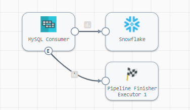
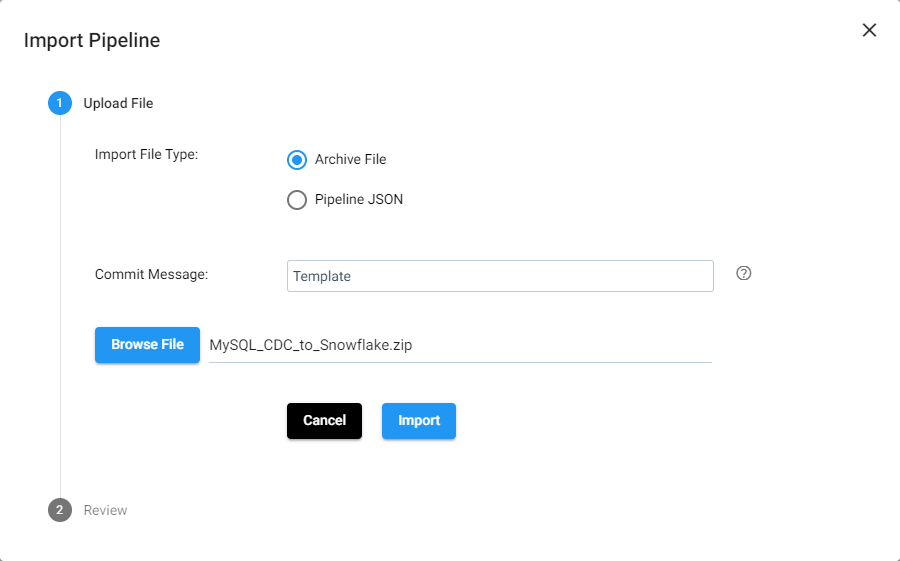
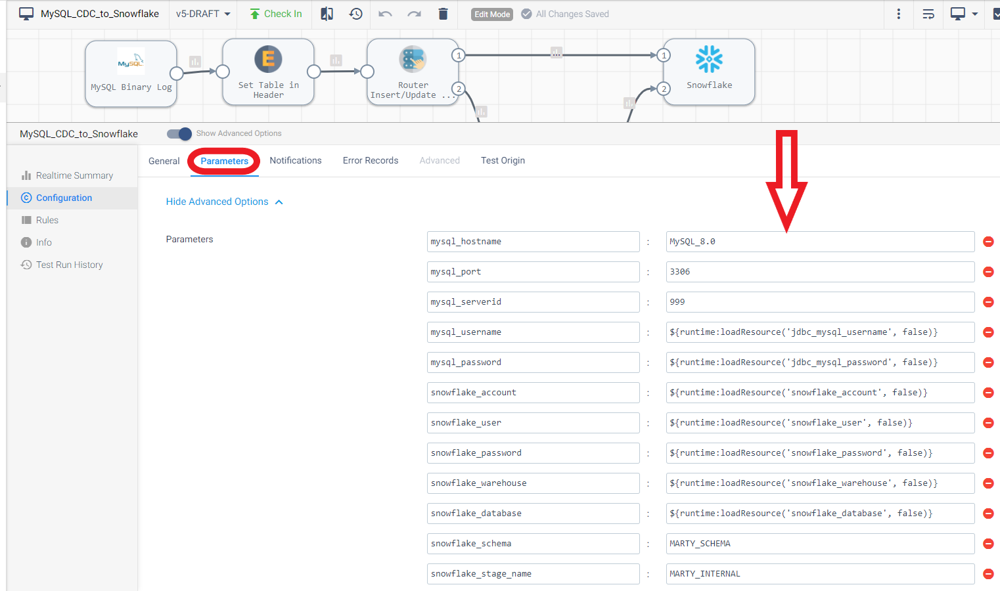
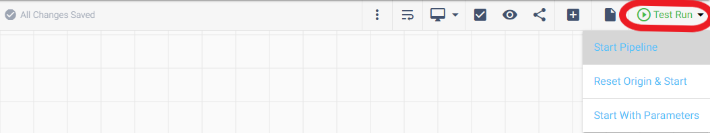
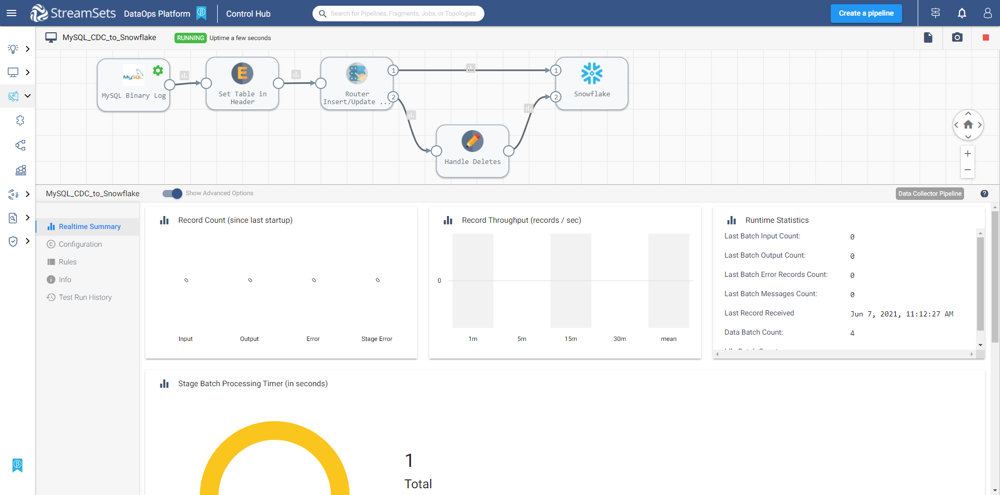
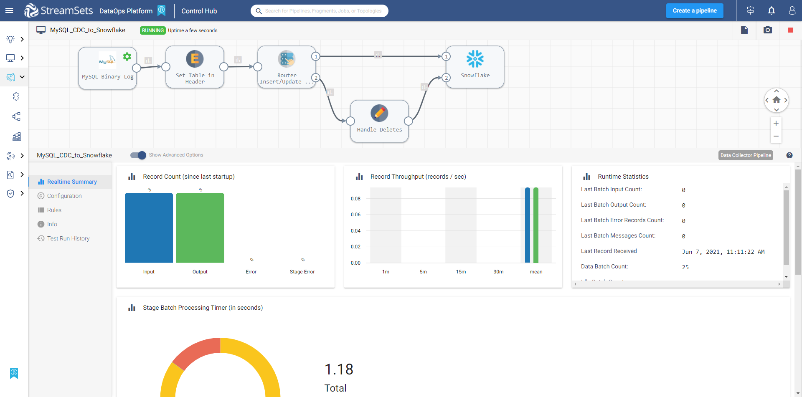

<h1>
MySQL to Snowflake - BULK and CDC
</h1>

# MySQL to Snowflake - BULK and CDC

**Important:** *These instructions assume you have access to [StreamSets DataOps Platform](https://cloud.login.streamsets.com/signup) and have installed StreamSets Data Collector (v5.x+) and have performed all the prerequisites for MySQL and Snowflake*

- For help with MySQL Binary Log prerequisites, see [MySQL Binary Log](https://docs.streamsets.com/portal/platform-datacollector/latest/datacollector/UserGuide/Origins/MySQLBinaryLog.html#concept_kqg_1yh_xx).
- For help with Snowflake prerequisites, see [Snowflake](https://docs.streamsets.com/portal/platform-datacollector/latest/datacollector/UserGuide/Destinations/Snowflake.html#concept_vxl_zzc_1gb).

## OVERVIEW

In order to setup a Change Data Capture (CDC) process, you will need to perform a BULK load in order to instantiate the data in your destination which will run once and then perform continuous CDC to keep the data in sync.

The first pipeline (**MySQL[a]_Snowflake_BULK**) will be a batch pipeline that runs once and reads data from MySQL and loads data to Snowflake.

The second pipeline (**MySQL[b]_Snowflake_CDC**) will be a streaming pipeline that will replicate changes from your source to the destination performing inserts, updates and deletes.

**Disclaimer:** *These pipelines are meant to serve as a template for performing bulk and CDC from MNySQL to Snowflake.  Some of the parameters, tables and fields may be different for your environment and may need additional customizations.  Please consult the StreamSets documentation (linked below) for full information on configuration of each stage used below.*

## PIPELINE #1 - BULK load

## DOCUMENTATION

[JDBC Multitable Consumer](https://docs.streamsets.com/portal/platform-datacollector/latest/datacollector/UserGuide/Origins/MultiTableJDBCConsumer.html#concept_zp3_wnw_4y)

[Snowflake Destination](https://docs.streamsets.com/portal/platform-datacollector/latest/datacollector/UserGuide/Destinations/Snowflake.html#concept_vxl_zzc_1gb)

[Pipeline Finisher](https://docs.streamsets.com/portal/platform-datacollector/latest/datacollector/UserGuide/Executors/PipelineFinisher.html#concept_qzm_l4r_kz)

## STEP-BY-STEP

### Step 1: Download the pipeline

[Click Here](./MySQL[a]_Snowflake_BULK.zip?raw=true) to download the pipeline and save it to your drive.

### Step 2: Import the pipeline

https://github.com/streamsets/sample-pipelines/blob/master/Data%20Collector/MySQL%20to%20Snowflake%20-%20BULK%20and%20CDC/MySQL_a_Snowflake_BULK.zip

Click the up arrow in the Pipelines list to start the import process.

Select 'Archive File', enter a Commit Message, then click "Browse File" and locate the pipeline file you just downloaded and select it. Click "Import"

### Step 3: Configure the parameters

Click on the pipeline you just imported to open it and click on the "Parameters" tab and fill in the appropriate information for your environment.

**Important:** *The pipeline template uses the most common default settings for things like the Snowflake region, staging location, etc. All of these are configurable and if you need to change those, you can opt to not use the built-in parameters and choose the appropriate settings yourself. Please refer to the documentation listed in this document for all the available options.*

The following parameters are set up for this pipeline:

<table>
  <tr>
   <td><code>mysql_hostname</code>
   </td>
   <td class="entry cellrowborder" headers="d436212e756 ">MySQL server hostname.</td>
  </tr>
  <tr>
   <td><code>mysql_port</code>
   </td>
   <td class="entry cellrowborder" headers="d436212e756 ">MySQL server port. </td>
  </tr>
  <tr>
   <td><code>mysql_serverid</code>
   </td>
   <td class="entry cellrowborder" headers="d436212e756 ">Replication server ID that the origin uses to connect to
                                        the master MySQL server. Must be unique from the server ID
                                        of the replication master and of all the other replication
                                            slaves.
When the MySQL server database is enabled for
                                            GTID, the server ID is optional. 

</td>
  </tr>
  <tr>
   <td><code>mysql_username</code>
   </td>
   <td class="entry cellrowborder" headers="d436212e853 ">MySQL username. 
The user must have the following MySQL
                                                privileges:<ul>
                                                <li>REPLICATION CLIENT</li>
                                                <li>REPLICATION SLAVE</li>
                                            </ul>

</td>
  </tr>
  <tr>
   <td><code>mysql_password</code>
   </td>
   <td class="entry cellrowborder" headers="d436212e853 ">MySQL password.
Tip: To secure sensitive information such as user names and passwords, you can use <a class="xref" href="https://streamsets.com/documentation/datacollector/latest/help/index.html?contextID=concept_bs4_5nm_2s" title="Similar to runtime properties, runtime resources are values that you define in a file local to the Data Collector and call from within a pipeline. But with runtime resources, you can restrict the permissions for the files to secure information.">runtime resources</a> or <a class="xref" href="https://streamsets.com/documentation/datacollector/latest/help/index.html?contextID=concept_bt1_bpj_r1b">credential stores.</a>

</td>
  </tr>
  <tr>
   <td><code>snowflake_account</code>
   </td>
   <td class="entry cellrowborder" headers="d198512e2230 ">Snowflake account name.</td>
  </tr>
  <tr>
   <td><code>snowflake_user</code>
   </td>
   <td class="entry cellrowborder" headers="d198512e2230 ">Snowflake user name.</td>
  </tr>
  <tr>
   <td><code>snowflake_password</code>
   </td>
   <td class="entry cellrowborder" headers="d198512e2230 ">Snowflake password.</td>
  </tr>
  <tr>
   <td><code>snowflake_warehouse</code>
   </td>
   <td class="entry cellrowborder" headers="d198512e2372 ">Snowflake warehouse.</td>
  </tr>
  <tr>
   <td><code>snowflake_database</code>
   </td>
   <td class="entry cellrowborder" headers="d198512e2372 ">Snowflake database.</td>
  </tr>
  <tr>
   <td><code>snowflake_schema</code>
   </td>
   <td class="entry cellrowborder" headers="d198512e2372 ">Snowflake schema.</td>
  </tr>
  <tr>
   <td><code>snowflake_stage_name</code>
   </td>
   <td class="entry cellrowborder" headers="d198512e2713 ">Name of the Snowflake stage used to stage the data.
                                            
Unless using a Snowflake internal user stage, you
                                            create this stage as part of the <a class="xref" href="https://streamsets.com/documentation/datacollector/latest/help/index.html?contextID=concept_ysy_fcj_ggb">Snowflake prerequisite tasks</a>.

To use a
                                            Snowflake internal user stage, enter a tilde
                                                (<code class="ph codeph">~</code>).

</td>
  </tr>
</table>

### Step 4: Run the pipeline

Click the "START" button to run the pipeline.

### Step 5: Make changes to the MySQL source table and see the pipeline process them

## PIPELINE

## DOCUMENTATION

[MySQL Binlog Origin](https://streamsets.com/documentation/datacollector/latest/help/datacollector/UserGuide/Origins/MySQLBinaryLog.html)

[Expression Evaluator](https://streamsets.com/documentation/datacollector/latest/help/datacollector/UserGuide/Processors/Expression.html)

[StreamSelector](https://streamsets.com/documentation/datacollector/latest/help/datacollector/UserGuide/Processors/StreamSelector.html)

[Field Renamer](https://streamsets.com/documentation/datacollector/latest/help/datacollector/UserGuide/Processors/FieldRenamer.html)

[Snowflake Destination](https://streamsets.com/documentation/datacollector/latest/help/datacollector/UserGuide/Destinations/Snowflake.html)

## STEP-BY-STEP

### Step 1: Download the pipeline

[Click Here](./MySQL_CDC_to_Snowflake.zip?raw=true) to download the pipeline and save it to your drive.

### Step 2: Import the pipeline

Click the up arrow in the Pipelines list to start the import process.

Select 'Archive File', enter a Commit Message, then click "Browse File" and locate the pipeline file you just downloaded and select it. Click "Import"

### Step 3: Configure the parameters

Click on the pipeline you just imported to open it and click on the "Parameters" tab and fill in the appropriate information for your environment.

**Important:** *The pipeline template uses the most common default settings for things like the Snowflake region, staging location, etc. All of these are configurable and if you need to change those, you can opt to not use the built-in parameters and choose the appropriate settings yourself. Please refer to the documentation listed in this document for all the available options.*

The following parameters are set up for this pipeline:

<table>
  <tr>
   <td><code>mysql_hostname</code>
   </td>
   <td class="entry cellrowborder" headers="d436212e756 ">MySQL server hostname.</td>
  </tr>
  <tr>
   <td><code>mysql_port</code>
   </td>
   <td class="entry cellrowborder" headers="d436212e756 ">MySQL server port. </td>
  </tr>
  <tr>
   <td><code>mysql_serverid</code>
   </td>
   <td class="entry cellrowborder" headers="d436212e756 ">Replication server ID that the origin uses to connect to
                                        the master MySQL server. Must be unique from the server ID
                                        of the replication master and of all the other replication
                                            slaves.
When the MySQL server database is enabled for
                                            GTID, the server ID is optional. 

</td>
  </tr>
  <tr>
   <td><code>mysql_username</code>
   </td>
   <td class="entry cellrowborder" headers="d436212e853 ">MySQL username. 
The user must have the following MySQL
                                                privileges:<ul>
                                                <li>REPLICATION CLIENT</li>
                                                <li>REPLICATION SLAVE</li>
                                            </ul>

</td>
  </tr>
  <tr>
   <td><code>mysql_password</code>
   </td>
   <td class="entry cellrowborder" headers="d436212e853 ">MySQL password.
Tip: To secure sensitive information such as user names and passwords, you can use <a class="xref" href="https://streamsets.com/documentation/datacollector/latest/help/index.html?contextID=concept_bs4_5nm_2s" title="Similar to runtime properties, runtime resources are values that you define in a file local to the Data Collector and call from within a pipeline. But with runtime resources, you can restrict the permissions for the files to secure information.">runtime resources</a> or <a class="xref" href="https://streamsets.com/documentation/datacollector/latest/help/index.html?contextID=concept_bt1_bpj_r1b">credential stores.</a>

</td>
  </tr>
  <tr>
   <td><code>snowflake_account</code>
   </td>
   <td class="entry cellrowborder" headers="d198512e2230 ">Snowflake account name.</td>
  </tr>
  <tr>
   <td><code>snowflake_user</code>
   </td>
   <td class="entry cellrowborder" headers="d198512e2230 ">Snowflake user name.</td>
  </tr>
  <tr>
   <td><code>snowflake_password</code>
   </td>
   <td class="entry cellrowborder" headers="d198512e2230 ">Snowflake password.</td>
  </tr>
  <tr>
   <td><code>snowflake_warehouse</code>
   </td>
   <td class="entry cellrowborder" headers="d198512e2372 ">Snowflake warehouse.</td>
  </tr>
  <tr>
   <td><code>snowflake_database</code>
   </td>
   <td class="entry cellrowborder" headers="d198512e2372 ">Snowflake database.</td>
  </tr>
  <tr>
   <td><code>snowflake_schema</code>
   </td>
   <td class="entry cellrowborder" headers="d198512e2372 ">Snowflake schema.</td>
  </tr>
  <tr>
   <td><code>snowflake_stage_name</code>
   </td>
   <td class="entry cellrowborder" headers="d198512e2713 ">Name of the Snowflake stage used to stage the data.
                                            
Unless using a Snowflake internal user stage, you
                                            create this stage as part of the <a class="xref" href="https://streamsets.com/documentation/datacollector/latest/help/index.html?contextID=concept_ysy_fcj_ggb">Snowflake prerequisite tasks</a>.

To use a
                                            Snowflake internal user stage, enter a tilde
                                                (<code class="ph codeph">~</code>).

</td>
  </tr>
</table>

### Step 4: Run the pipeline

Click the "START" button to run the pipeline.

### Step 5: Make changes to the MySQL source table and see the pipeline process them

