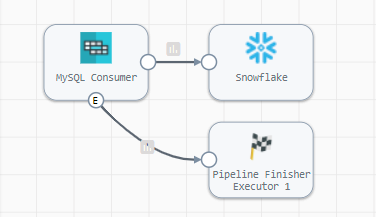
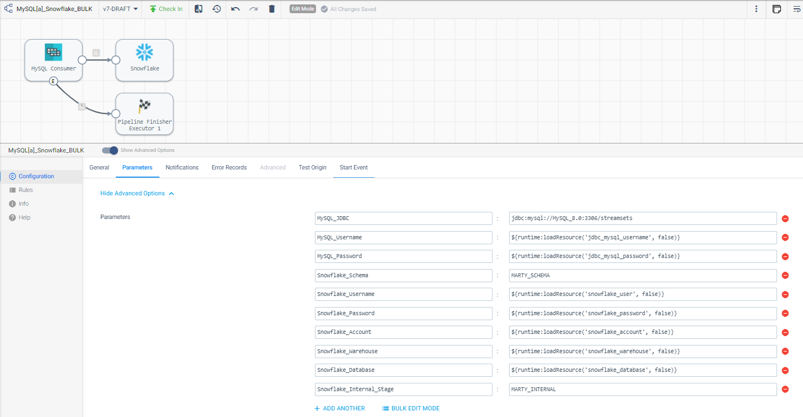
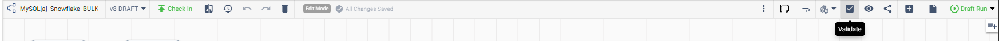
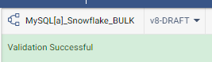
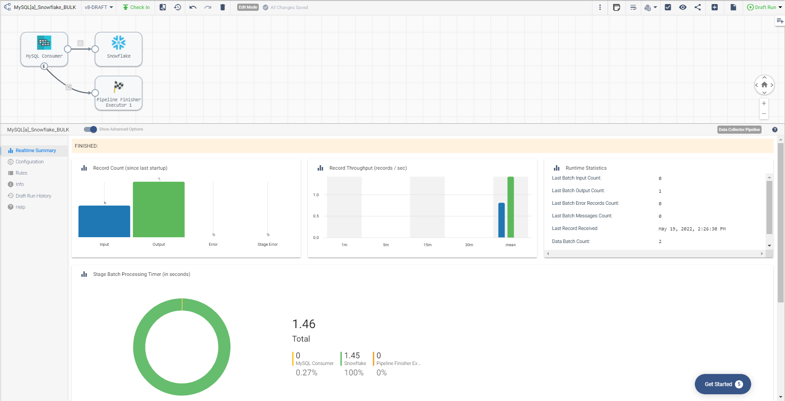

<h1>
MySQL to Snowflake - BULK
</h1>

# MySQL to Snowflake - BULK (Updated: 2022.05)

**Important:** *These instructions assume you have access to [StreamSets DataOps Platform](https://cloud.login.streamsets.com/signup) and have installed StreamSets Data Collector (v5.x+) and have performed all the prerequisites for Snowflake*

- For help with Snowflake prerequisites, see [Snowflake](https://docs.streamsets.com/portal/platform-datacollector/latest/datacollector/UserGuide/Destinations/Snowflake.html#concept_vxl_zzc_1gb).

## OVERVIEW

In order to setup a Change Data Capture (CDC) process, you will need to perform a BULK load in order to instantiate the data in your destination which will run once and then perform continuous CDC to keep the data in sync.

This pipeline (**MySQL[a]_Snowflake_BULK**) will be a batch pipeline that runs once and reads data from MySQL and loads data to Snowflake.

Once the BULK load has been done, you can then set up the second pipeline (**MySQL[b]_Snowflake_CDC**) which will be a streaming pipeline that will replicate changes from your source to the destination performing inserts, updates and deletes.  This is in a separate folder locate [here](https://github.com/streamsets/sample-pipelines/tree/master/Data%20Collector/MySQL%20to%20Snowflake%20-%20CDC)

**Disclaimer:** *These pipelines are meant to serve as a template for performing bulk loads from MySQL to Snowflake.  Some of the parameters, tables and fields may be different for your environment and may need additional customizations.  Please consult the StreamSets documentation (linked below) for full information on configuration of each stage used below.*

## PIPELINE - BULK load

## DOCUMENTATION

[JDBC Multitable Consumer](https://docs.streamsets.com/portal/platform-datacollector/latest/datacollector/UserGuide/Origins/MultiTableJDBCConsumer.html#concept_zp3_wnw_4y)

[Snowflake Destination](https://docs.streamsets.com/portal/platform-datacollector/latest/datacollector/UserGuide/Destinations/Snowflake.html#concept_vxl_zzc_1gb)

[Pipeline Finisher](https://docs.streamsets.com/portal/platform-datacollector/latest/datacollector/UserGuide/Executors/PipelineFinisher.html#concept_qzm_l4r_kz)

## STEP-BY-STEP

### Step 1: Download the pipeline

[Click Here](./MySQL[a]_Snowflake_BULK.zip?raw=true) to download the pipeline and save it to your drive.

### Step 2: Import the pipeline

**For more information on Importing Pipelines, click [here](https://docs.streamsets.com/portal/platform-controlhub/controlhub/UserGuide/ExportImport/Importing.html#concept_gsm_tjx_bdb)**

Click the up arrow in the Pipelines list to start the import process.

Select 'Archive File', enter a Commit Message, then click "Browse File" and locate the pipeline file you just downloaded and select it. Click "Import"

### Step 3: Configure the parameters

Click on the pipeline you just imported to open it and click on the "Parameters" tab and fill in the appropriate information for your environment.

**Important:** *The pipeline template uses the most common default settings for things like the Snowflake region, staging location, etc. All of these are configurable and if you need to change those, you can opt to not use the built-in parameters and choose the appropriate settings yourself. Please refer to the documentation listed in this document for all the available options.*

The following parameters are set up for this pipeline:

| Parameter Name | Description |
| --- | --- |
| MySQL JDBC | Connection string used to connect to the database. Use the connection string format required by the database vendor. For example, use the following formats for these database vendors: MySQL - jdbc:mysql://<host>:<port>/<database_name>|
| MySQL_Username | User name for the JDBC connection. The user account must have the correct permissions or privileges in the database.|
| MySQL_Password | Password for the JDBC user name. Tip: To secure sensitive information such as user names and passwords, you can use [runtime resources](https://docs.streamsets.com/portal/platform-datacollector/latest/datacollector/UserGuide/Pipeline_Configuration/RuntimeValues.html#concept_bs4_5nm_2s) or [credential stores](https://docs.streamsets.com/portal/platform-datacollector/latest/datacollector/UserGuide/Configuration/CredentialStores.html#concept_bt1_bpj_r1b).
| Snowflake_Schema | Snowflake schema. |
| Snowflake_Username | Snowflake user name. The user account or the custom role that overrides the default role for this user account must have the required Snowflake privileges. The required privileges depend on the load method that the destination uses. For details, see [Prerequisites](https://docs.streamsets.com/portal/platform-datacollector/latest/datacollector/UserGuide/Destinations/Snowflake.html#concept_ysy_fcj_ggb). |
| Snowflake_Password | Snowflake password. |
| Snowflake_Account | Snowflake account name. |
| Snowflake_Warehouse | Snowflake warehouse. |
| Snowflake_Database | Snowflake database. |
| Snowflake_Internal_Stage | Name of the Snowflake stage used to stage the data. Unless using a Snowflake internal user stage, you create this stage as part of the [Snowflake prerequisite tasks](https://docs.streamsets.com/portal/platform-datacollector/latest/datacollector/UserGuide/Destinations/Snowflake.html#concept_ysy_fcj_ggb). To use a Snowflake internal user stage, enter a tilde (~). |

#### Other settings

You may want to check the following settings:
| Location | Setting |
| --- | --- |
| JDBC Origin --> Tables | Schema and Table name pattern Use wildcards (%) to slect multiple Schemas and/or Tables |
| Snowflake Destination --> Snowflake Connection Info | Snowflake Region - Verify the correct entry
| | |

### Step 3a: Validate the pipeline

Once the parameters have been entered, you will want to validate the pipeline and address any issues.

### Step 4: Run the pipeline

Click the "Draft Run" button and select Reset Origin & Start option to run the pipeline.

