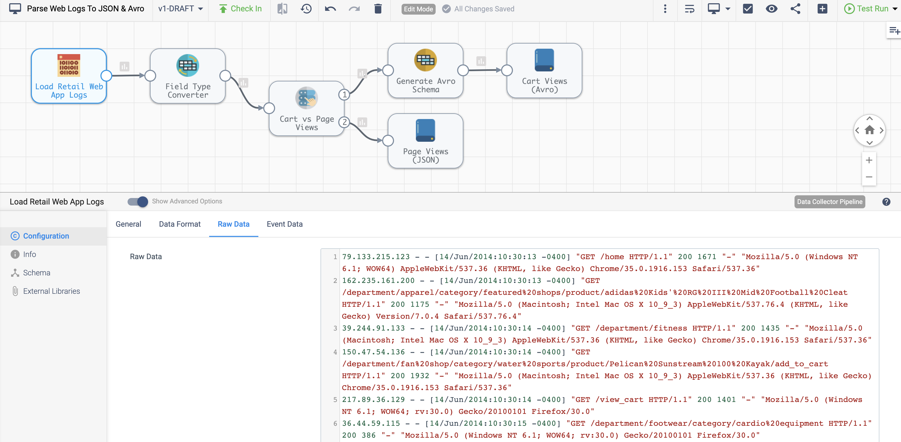
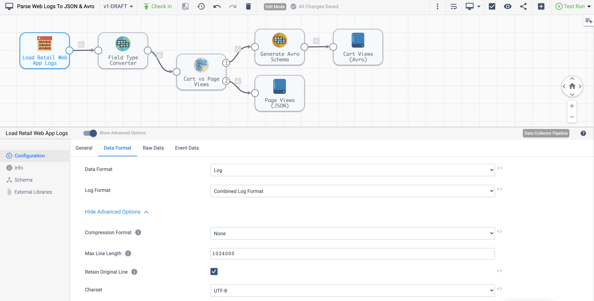
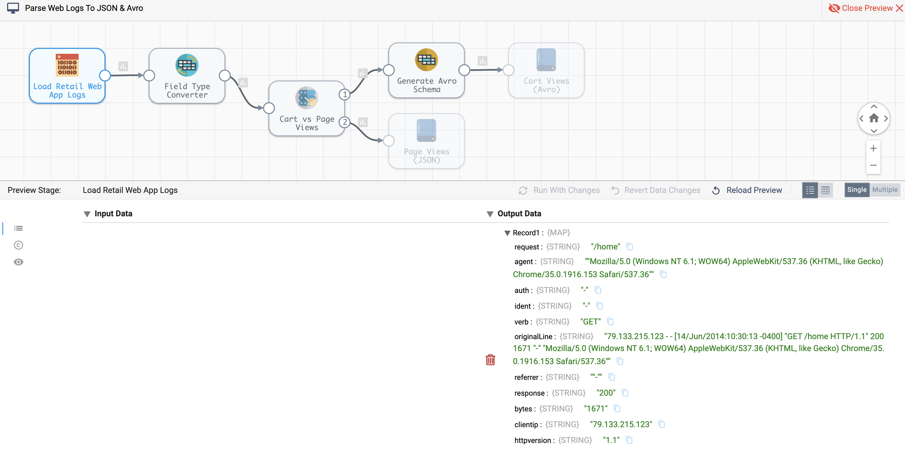
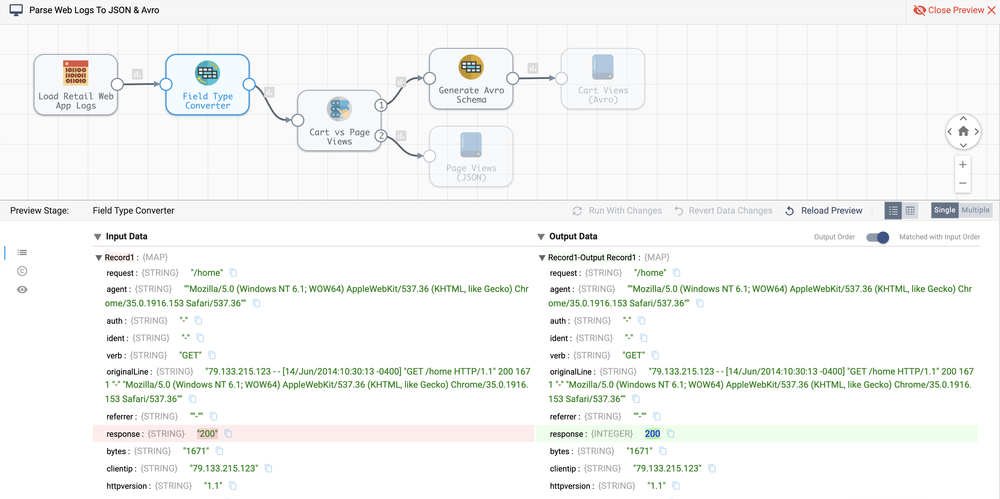

Parse Web Logs To JSON And Avro
===============================

This pipeline demonstrates how to parse raw web logs ingested in Common Log Format and store curated data in JSON and Avro formats.

Setup And Technical Details
---------------------------

* Download the [pipeline](Parse%20Web%20Logs%20To%20JSON%20%26%20Avro.json) and import it into your Data Collector
* Update the following pipeline parameters
    * ADDED_TO_CART_FS_FOLDER
        * This is the path to the folder where you'd like Avro output file to be created
    * PAGE_VIEWS_FS_FOLDER
        * This is the path to the folder where you'd like JSON output file to be created
    * ADDED_TO_CART_FILE_PREFIX
        * This is the prefix you'd like to add to the Avro output file
    * PAGE_VIEWS_FILE_PREFIX
        * This is the prefix you'd like to add to the JSON output file

Pipeline Overview
-----------------

The pipeline has been prepopulated with sample web logs using Dev Raw Data Source origin so you don't have to worry about loading it.

Note that the origin's Data Format has been configured to **Log** >> **Common Log Format**. This makes it really easy to have the web logs automatically parsed. For a complete list of origins that support this and other formats, refer to the [documentation](https://streamsets.com/documentation/datacollector/latest/help/datacollector/UserGuide/Apx-DataFormats/DataFormat_Title.html#concept_kgd_11c_kv).

Pipeline Preview
----------------

Once you have updated the pipeline parameters, click on **Preview** icon to see how the data is being transformed as it is flowing through various stages in the pipeline. For details on data preview, refer to the [documentation](https://streamsets.com/documentation/datacollector/latest/help/datacollector/UserGuide/Data_Preview/DataPreview_Title.html#concept_jjk_23z_sq).

**Origin**

As shown above, the logs in Common Log Format are being read by the origin and automatically transformed into a *column/field: value* pairs of records.

**Field Type Converter**

Using [Field Type Converter](https://streamsets.com/documentation/datacollector/latest/help/datacollector/UserGuide/Processors/FieldTypeConverter.html#concept_is3_zkp_wq) columns *response* and *timestamp* are being converted from string to integer and datetime data types respectively.

**Stream Selector**

Using [Stream Selector](https://streamsets.com/documentation/datacollector/latest/help/datacollector/UserGuide/Processors/StreamSelector.html#concept_tqv_t5r_wq) the records are conditionally routed to different paths based on condition *${str:contains(record:value("/request"), "add_to_cart")}* -- which implies that if the record column *request* (which is the HTTP request URL) contains *add_to_cart*, then we'd like to store those record in Avro format. All other records such as regular page views will be stored in JSON format.

**Schema Generator**

For the records that need to be stored in Avro format, [Schema Generator](https://streamsets.com/documentation/datacollector/latest/help/datacollector/UserGuide/Processors/SchemaGenerator.html#concept_rfz_ks3_x1b) will automatically generate schema for those records.

*Note:* You can also configure Schema Generator to cache schema so it's not calculated for every single record. For details, refer to the [documentation](https://streamsets.com/documentation/datacollector/latest/help/datacollector/UserGuide/Processors/SchemaGenerator.html#concept_rjk_y1q_1bb).

Pipeline Run
------------

Provided you've updated the pipeline parameters and there aren't any validation errors, running the pipleline should create two output files.

**Avro** -- for requests going to carts: [Sample output file](output/added-to-cart-a8a11b6c-d8fc-11ea-9149-abc78c1550f2_19aa3278-119c-4820-b11b-d58637a7b275.avro).

**JSON** -- for regular page views: [Sample output file](output/page-views-a8a11b6c-d8fc-11ea-9149-abc78c1550f2_69b93e73-ac07-45ab-b89b-90550dc14ad9.json).

