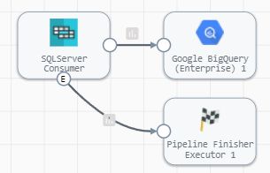
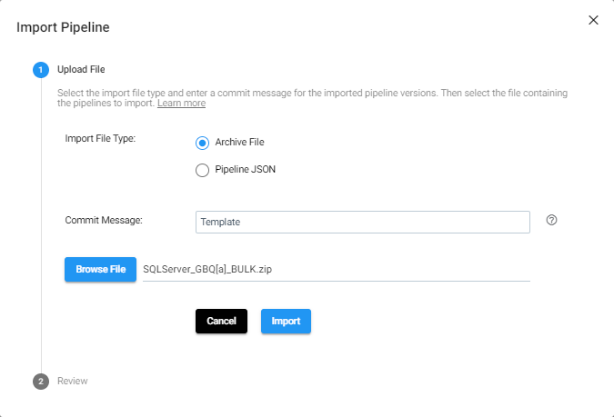
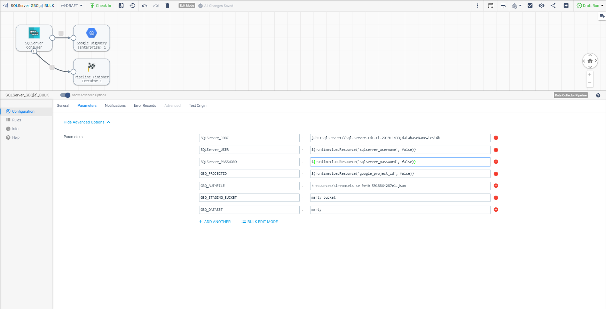
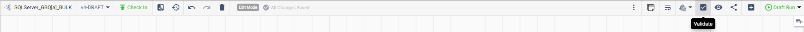
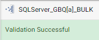
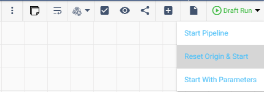
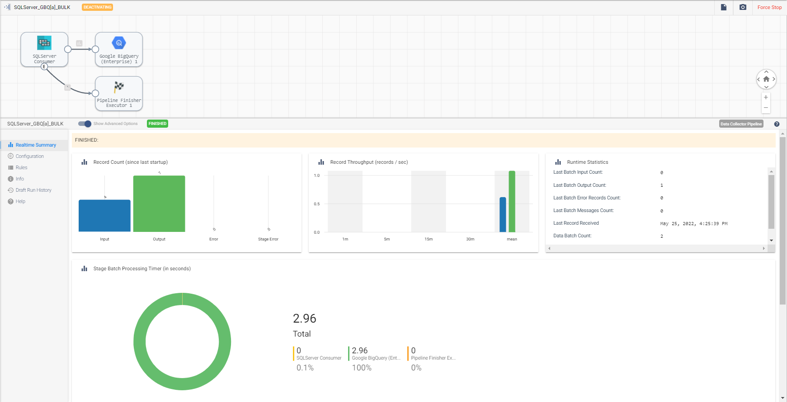

<h1>
SQLServer to BigQuery - BULK
</h1>

# SQLServer to BigQuery - BULK (Updated: 2022.05)

## Built with Data Collector v5.0.0 - please use engine v5+
## PREREQUISITES

* Access to [StreamSets DataOps Platform](https://cloud.login.streamsets.com/) account
  * Setup [Environment](https://docs.streamsets.com/portal/#platform-controlhub/controlhub/UserGuide/Environments/Overview.html#concept_z4x_nw2_v4b)
  * Setup [Deployment](https://docs.streamsets.com/portal/#platform-controlhub/controlhub/UserGuide/Deployments/Overview.html#concept_srv_jgf_v4b) with engine type [Data Collector](https://docs.streamsets.com/portal/#datacollector/latest/help/datacollector/UserGuide/Getting_Started/GettingStarted_Title.html#concept_sjz_rmx_3q)
    * Once a deployment has been successfully activated, the Data Collector engine should be up
and running before you can create pipelines and run jobs.
* Access to [Google BigQuery](https://cloud.google.com/free/) account
* Access to SQLServer database
  * Check [versions of SQLServer](https://docs.streamsets.com/portal/#datacollector/4.0.x/help/datacollector/UserGuide/Installation/SupportedSystemVersions.html#concept_k4l_5ft_v4b) supported for CDC

Complete [Google BigQuery prerequisites](https://docs.streamsets.com/portal/platform-datacollector/latest/datacollector/UserGuide/Destinations/GBigQuery.html#concept_vsg_fxb_3rb)

## OVERVIEW

In order to setup a Change Data Capture (CDC) process, you will need to perform a BULK load in order to instantiate the data in your destination, which will run once, and then perform continuous CDC to keep the data in sync.

This pipeline (**SQLServer_GBQ[a]_BULK**) will be a batch pipeline that runs once and reads data from SQLServer and loads data to BigQuery.

Once the BULK load has been done, you can then set up the second pipeline (**SQLServer_GBQ[b]_CDC**) which will be a streaming pipeline that will replicate changes from your source to the destination performing inserts, updates and deletes.  This is in a separate folder locate [here](https://github.com/streamsets/sample-pipelines/tree/master/Data%20Collector/SQLServer%20to%20BigQuery%20-%20CDC)

**Disclaimer:** *These pipelines are meant to serve as a template.  Some of the parameters, tables and fields may be different for your environment and may need additional customizations.  Please consult the StreamSets documentation (linked below) for full information on configuration of each stage used below.*

## PIPELINE - BULK load

## DOCUMENTATION

[JDBC Multitable Consumer](https://docs.streamsets.com/portal/platform-datacollector/latest/datacollector/UserGuide/Origins/MultiTableJDBCConsumer.html#concept_zp3_wnw_4y)

[Google BigQuery (Enterprise) Destination](https://docs.streamsets.com/portal/platform-datacollector/latest/datacollector/UserGuide/Destinations/GBigQuery.html#concept_nfr_by1_3rb)

[Pipeline Finisher](https://docs.streamsets.com/portal/platform-datacollector/latest/datacollector/UserGuide/Executors/PipelineFinisher.html#concept_qzm_l4r_kz)

## STEP-BY-STEP

### Step 1: Download the pipeline

[Click Here](./SQLServer_GBQ[a]_BULK.zip?raw=true) to download the pipeline and save it to your drive.

### Step 2: Import the pipeline

**For more information on Importing Pipelines, click [here](https://docs.streamsets.com/portal/platform-controlhub/controlhub/UserGuide/ExportImport/Importing.html#concept_gsm_tjx_bdb)**

Click the up arrow in the Pipelines list to start the import process.

Select 'Archive File', enter a Commit Message, then click "Browse File" and locate the pipeline file you just downloaded and select it. Click "Import"

### Step 3: Configure the parameters

Click on the pipeline you just imported to open it and click on the "Parameters" tab and fill in the appropriate information for your environment.

**Important:** *The pipeline template uses the most common default settings for things like the GBQ region, staging location, etc. All of these are configurable and if you need to change those, you can opt to not use the built-in parameters and choose the appropriate settings yourself. Please refer to the documentation listed in this document for all the available options.*

The following parameters are set up for this pipeline:

| Parameter Name | Description |
| --- | --- |
| SQLServer_JDBC | Connection string used to connect to the database. Use the connection string format required by the database vendor. For example, use the following formats for these database vendors: SQL Server - jdbc:sqlserver://[host]:[port];databaseName=[database_name]|
| SQLServer_USER | User name for the JDBC connection. The user account must have the correct permissions or privileges in the database.|
| SQLServer_PASSWORD | Password for the JDBC user name. Tip: To secure sensitive information such as user names and passwords, you can use [runtime resources](https://docs.streamsets.com/portal/platform-datacollector/latest/datacollector/UserGuide/Pipeline_Configuration/RuntimeValues.html#concept_bs4_5nm_2s) or [credential stores](https://docs.streamsets.com/portal/platform-datacollector/latest/datacollector/UserGuide/Configuration/CredentialStores.html#concept_bt1_bpj_r1b).
| GBQ_PROJECTID | Project ID to connect to. |
| GBQ_AUTHFILE | Path to the Google Cloud service account credentials file used to connect. The credentials file must be a JSON file. |
| GBQ_STAGING_BUCKET | Location to stage the pipeline data in CSV files. At this time, only Google Cloud Storage is supported as the staging location. |
| GBQ_DATASET | BigQuery datasets to load data into. To load data into a single dataset, enter the dataset name. To load data into multiple datasets, enter an expression that evaluates to the field in the record that contains the dataset name. For example: ${record:value('/dataset')} |

### Other settings

You may want to check the following settings:
| Location | Setting |
| --- | --- |
| JDBC Origin --> Tables | Schema and Table name pattern Use wildcards (%) to slect multiple Schemas and/or Tables |
| BigQuery Destination | Verify the correct entries for connecting to BigQuery |
| | |

### Step 3a: Validate the pipeline

Once the parameters have been entered, you will want to validate the pipeline and address any issues.

### Step 4: Run the pipeline

Click the "Draft Run" button and select Reset Origin & Start option to run the pipeline.

